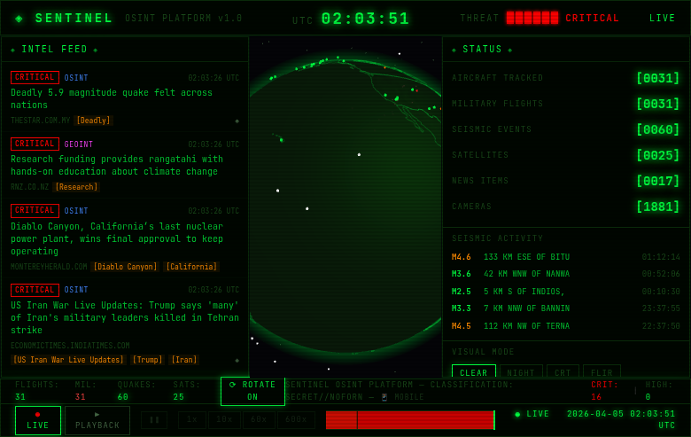

# SENTINEL

A full-screen OSINT intelligence dashboard with a CRT/terminal aesthetic. Renders live global data — flight traffic, earthquakes, satellites, news events, GDELT geopolitical events, and public IP cameras — onto a 3D globe, with a 4D playback mode for scrubbing through captured history.



## Features

- **3D globe** with live data layers (vanilla Three.js)
- **Live feeds**:
  - Flight tracking (civilian + military) — [airplanes.live](https://airplanes.live)
  - Seismic events — USGS
  - Satellite positions — computed from orbital elements (ISS, GPS, Starlink, weather sats, etc.)
  - News intelligence — via local [SearXNG](https://github.com/searxng/searxng) with entity/priority/category classification
  - GDELT geopolitical events
  - Public traffic cameras (NYC, London, Caltrans, Toronto, Singapore) + Insecam open IP cams
- **4D playback mode** — scrub backwards through captured history with play/pause, 1x/10x/60x/600x speed, event-density timeline histogram
- **Visual modes**: CLEAR, NIGHT, CRT, FLIR
- **Mobile view** at `/mobile` — stacked layout for phones
- **Boot sequence** + scanlines + phosphor glow aesthetic

## Stack

- Next.js 14 (App Router) + TypeScript
- Three.js 0.169 (vanilla, not react-three-fiber)
- SQLite (better-sqlite3) for playback capture store
- PM2 for production process management

## Running locally

### Prerequisites

- Node 20+ (developed on 22)
- A local [SearXNG](https://github.com/searxng/searxng-docker) instance on `http://localhost:8080` for the news intel feed (optional — the app falls back to simulated intel items if unavailable)

### Dev server

```bash
npm install
npm run dev
# → http://localhost:3000
```

### Production (port 3201)

```bash
npm run build
pm2 start ecosystem.config.js
pm2 save
```

This launches two PM2 processes:

- `sentinel` — the Next.js app on port 3201
- `sentinel-capture` — background daemon snapshotting live APIs into `data/sentinel.db` so playback mode has history to scrub

Playback mode becomes useful after the capture daemon has been running for 30+ minutes. Before that, it will always land on the earliest captured snapshot.

## Architecture

```
┌──────────────────────┐     writes      ┌──────────────────┐
│ sentinel-capture     │ ──────────────▶ │ data/sentinel.db │
│  (polls live APIs)   │                 │    (SQLite)      │
└──────────────────────┘                 └────────┬─────────┘
                                                  │ reads
                                                  ▼
┌──────────────────────┐                 ┌──────────────────┐
│ sentinel (3201)      │ ──── /api/ ───▶ │ playback routes  │
│  - live mode         │                 └──────────────────┘
│  - playback mode     │
└──────────────────────┘
```

- `app/page.tsx` owns all frontend state and polling intervals (flights 30s, earthquakes 60s, satellites 10s, intel 45s, GDELT 15min, cameras 5min). Same setters feed the Globe from either `/api/*` (live) or `/api/playback/*` (historical) depending on mode.
- `app/components/Globe.tsx` is vanilla Three.js with OrbitControls. Requires `transpilePackages: ['three']` in `next.config.mjs`.
- `services/capture/index.ts` is a long-running Node process (via `tsx`) that hits the live API routes on their natural intervals and writes snapshots. Prunes data older than 7 days.
- Satellites are NOT captured — positions are computed deterministically from orbital elements, so playback recomputes on demand.
- Cameras are NOT captured either — they're position-static and images are live-only.

## Data layout

```
app/
├── api/
│   ├── flights/          live feeds
│   ├── earthquakes/
│   ├── satellites/
│   ├── intel/            (SearXNG proxy + enrichment)
│   ├── gdelt/
│   ├── cameras/
│   ├── playback/[resource]/   time-windowed queries against SQLite
│   └── timeline/         capture-window metadata + event density histogram
├── components/           Globe, IntelFeed, StatusPanel, TimelineBar, etc.
├── mobile/               /mobile route with phone-friendly layout
└── page.tsx              main dashboard
lib/
├── orbital.ts            satellite orbital math (shared between live/playback)
└── playback-db.ts        read-only SQLite singleton
services/capture/         background capture daemon + SQLite schema
```

## Credits

Inspired by Bilawal Sidhu's "Worldview" demos.

External APIs used (all free, no keys required):

- [airplanes.live](https://airplanes.live) — ADS-B aircraft tracking
- [USGS Earthquake Hazards](https://earthquake.usgs.gov/earthquakes/feed/v1.0/summary/) — seismic feed
- [GDELT Project](https://www.gdeltproject.org) — geopolitical events
- [ArcGIS World Imagery](https://server.arcgisonline.com) — tile layer
- NYC DOT, Transport for London, Caltrans, City of Toronto, LTA Singapore — traffic cameras
- [Insecam](http://insecam.org) — public IP cameras
